# 🔄 CENÁRIOS DE FLUXO COMPLETO
## Fluxos Operacionais Integrados do E-commerce

### 🎯 **Objetivo**
Documentar os cenários de uso completo que demonstram como todas as APIs trabalham em conjunto para suportar o frontend da FASE 3.

---

## 🛍️ **CENÁRIO 1: JORNADA COMPLETA DO CLIENTE**

### **1.1 Entrada e Navegação**


### **1.2 Busca e Filtros**


### **1.3 Visualização de Produto**
```mermaid
sequenceDiagram
    participant U as Usuário
    participant F as Frontend
    participant P as Products API
    participant N as Navigation API
    participant A as Analytics API
    participant R as Recommendations API

    U->>F: Clica em produto
    F->>P: GET /api/v1.0/products/{id}
    F->>N: POST /api/v1.0/navigation/track/product
    F->>R: GET /api/v1.0/products/{id}/related
    F->>A: POST /api/v1.0/analytics/events
    F->>U: Exibe detalhes + relacionados
```

### **1.4 Adição ao Carrinho**
```mermaid
sequenceDiagram
    participant U as Usuário
    participant F as Frontend
    participant C as Cart API
    participant N as Navigation API
    participant A as Analytics API

    U->>F: Clica "Adicionar ao Carrinho"
    F->>C: POST /api/v1.0/cart/add
    F->>N: POST /api/v1.0/navigation/track/product
    F->>A: POST /api/v1.0/analytics/events
    F->>U: Confirma adição
```

---

## 🛒 **CENÁRIO 2: PROCESSO DE CHECKOUT**

### **2.1 Início do Checkout**
```mermaid
sequenceDiagram
    participant U as Usuário
    participant F as Frontend
    participant C as Checkout API
    participant N as Navigation API
    participant A as Analytics API

    U->>F: Clica "Finalizar Compra"
    F->>C: POST /api/v1.0/checkout/init
    F->>N: POST /api/v1.0/navigation/track/page
    F->>A: POST /api/v1.0/analytics/events
    F->>U: Redireciona para checkout
```

### **2.2 Step 1 - Carrinho**


### **2.3 Step 2 - Dados Pessoais**
```mermaid
sequenceDiagram
    participant U as Usuário
    participant F as Frontend
    participant C as Checkout API
    participant V as Validation API

    U->>F: Preenche dados pessoais
    F->>C: POST /api/v1.0/checkout/{id}/validate
    F->>V: POST /api/v1.0/validation/customer
    F->>U: Exibe validação
    U->>F: Clica "Continuar"
    F->>C: PUT /api/v1.0/checkout/{id}/step
```

### **2.4 Step 3 - Entrega**
```mermaid
sequenceDiagram
    participant U as Usuário
    participant F as Frontend
    participant C as Checkout API
    participant S as Shipping API
    participant V as Validation API

    U->>F: Preenche endereço
    F->>C: POST /api/v1.0/checkout/{id}/shipping/calculate
    F->>S: POST /api/v1.0/shipping/calculate
    F->>V: POST /api/v1.0/validation/address
    F->>U: Exibe opções de frete
    U->>F: Seleciona frete
    F->>C: PUT /api/v1.0/checkout/{id}/step
```

### **2.5 Step 4 - Pagamento**
```mermaid
sequenceDiagram
    participant U as Usuário
    participant F as Frontend
    participant C as Checkout API
    participant P as Payment API
    participant V as Validation API

    U->>F: Preenche dados do cartão
    F->>C: POST /api/v1.0/checkout/{id}/payment
    F->>P: POST /api/v1.0/payment/process
    F->>V: POST /api/v1.0/validation/payment
    F->>U: Exibe resultado
    U->>F: Clica "Continuar"
    F->>C: PUT /api/v1.0/checkout/{id}/step
```

### **2.6 Step 5 - Confirmação**


---

## 📊 **CENÁRIO 3: SISTEMA DE ANALYTICS**

### **3.1 Tracking de Eventos**
```mermaid
sequenceDiagram
    participant U as Usuário
    participant F as Frontend
    participant A as Analytics API
    participant N as Navigation API
    participant D as Database

    U->>F: Interage com o site
    F->>A: POST /api/v1.0/analytics/events
    F->>N: POST /api/v1.0/navigation/track/*
    A->>D: Armazena eventos
    A->>D: Atualiza métricas em tempo real
```

### **3.2 Dashboard de Métricas**
```mermaid
sequenceDiagram
    participant A as Admin
    participant F as Frontend
    participant A as Analytics API
    participant D as Database
    participant C as Cache

    A->>F: Acessa dashboard
    F->>A: GET /api/v1.0/analytics/dashboard
    A->>C: Verifica cache
    C->>A: Retorna dados em cache
    A->>D: Consulta dados agregados
    A->>F: Exibe métricas
```

### **3.3 Relatórios Personalizados**
```mermaid
sequenceDiagram
    participant A as Admin
    participant F as Frontend
    participant A as Analytics API
    participant D as Database
    participant Q as Query Engine

    A->>F: Solicita relatório
    F->>A: POST /api/v1.0/analytics/reports
    A->>Q: Processa consulta
    Q->>D: Executa query
    A->>F: Retorna relatório
```

---

## 🤖 **CENÁRIO 4: SISTEMA DE RECOMENDAÇÕES**

### **4.1 Geração de Recomendações**
```mermaid
sequenceDiagram
    participant U as Usuário
    participant F as Frontend
    participant R as Recommendations API
    participant N as Navigation API
    participant A as Analytics API
    participant ML as ML Engine

    U->>F: Visualiza produto
    F->>R: GET /api/v1.0/recommendations/{userId}
    R->>N: GET /api/v1.0/navigation/history
    R->>A: GET /api/v1.0/analytics/user-behavior
    R->>ML: POST /api/v1.0/ml/generate-recommendations
    R->>F: Retorna recomendações
    F->>U: Exibe produtos relacionados
```

### **4.2 Feedback Loop**
```mermaid
sequenceDiagram
    participant U as Usuário
    participant F as Frontend
    participant R as Recommendations API
    participant A as Analytics API
    participant ML as ML Engine

    U->>F: Clica em recomendação
    F->>R: POST /api/v1.0/recommendations/feedback
    F->>A: POST /api/v1.0/analytics/events
    R->>ML: POST /api/v1.0/ml/update-model
    ML->>R: Atualiza scores
```

---

## ❓ **CENÁRIO 5: SISTEMA DE FAQ/SUPORTE**

### **5.1 Busca no FAQ**


### **5.2 Criação de Ticket**


---

## 🔄 **CENÁRIO 6: FLUXO DE DADOS EM TEMPO REAL**

### **6.1 Sincronização de Estado**
```mermaid
sequenceDiagram
    participant U1 as Usuário 1
    participant U2 as Usuário 2
    participant F as Frontend
    participant N as Navigation API
    participant A as Analytics API
    participant WS as WebSocket

    U1->>F: Adiciona produto ao carrinho
    F->>N: POST /api/v1.0/navigation/track/product
    F->>A: POST /api/v1.0/analytics/events
    WS->>U2: Atualiza recomendações em tempo real
```

### **6.2 Cache e Performance**


---

## 📈 **CENÁRIO 7: MIGRAÇÃO DE MOCKS**

### **7.1 Substituição Gradual**


### **7.2 Validação de Compatibilidade**
```mermaid
sequenceDiagram
    participant F as Frontend
    participant T as Tests
    participant API as Real APIs
    participant M as Mocks

    T->>F: Executa testes
    F->>API: Testa endpoints reais
    F->>M: Compara com mocks
    T->>F: Valida compatibilidade
    F->>API: Confirma funcionamento
```

---

## 🎯 **CENÁRIOS DE ERRO E RECUPERAÇÃO**

### **8.1 Falha de API**
```mermaid
sequenceDiagram
    participant U as Usuário
    participant F as Frontend
    participant API as API
    participant F as Fallback
    participant M as Mocks

    U->>F: Solicita dados
    F->>API: GET /api/v1.0/data
    API->>F: Erro 500
    F->>F: Ativa fallback
    F->>M: Usa dados mockados
    F->>U: Exibe dados com aviso
```

### **8.2 Timeout e Retry**
```mermaid
sequenceDiagram
    participant U as Usuário
    participant F as Frontend
    participant API as API
    participant R as Retry Logic

    U->>F: Solicita dados
    F->>API: GET /api/v1.0/data
    API->>F: Timeout
    F->>R: Executa retry
    R->>API: GET /api/v1.0/data (retry 1)
    API->>F: Sucesso
    F->>U: Exibe dados
```

---

## 🔒 **CENÁRIOS DE SEGURANÇA**

### **9.1 Autenticação e Autorização**
```mermaid
sequenceDiagram
    participant U as Usuário
    participant F as Frontend
    participant A as Auth API
    participant API as Protected API
    participant T as Token Service

    U->>F: Faz login
    F->>A: POST /api/v1.0/auth/login
    A->>T: Gera token
    A->>F: Retorna token
    F->>API: GET /api/v1.0/protected (com token)
    API->>T: Valida token
    API->>F: Retorna dados
```

### **9.2 Rate Limiting**
```mermaid
sequenceDiagram
    participant U as Usuário
    participant F as Frontend
    participant G as Gateway
    participant API as API
    participant R as Rate Limiter

    U->>F: Múltiplas requisições
    F->>G: POST /api/v1.0/data
    G->>R: Verifica limite
    alt Limite excedido
        R->>G: Bloqueia requisição
        G->>F: Erro 429
    else Limite OK
        G->>API: Processa requisição
        API->>F: Retorna dados
    end
```

---

## 📊 **MÉTRICAS DE SUCESSO DOS CENÁRIOS**

### **Indicadores de Performance**
- **Tempo de resposta**: < 200ms para endpoints críticos
- **Disponibilidade**: 99.9% uptime
- **Taxa de erro**: < 0.1% para transações
- **Throughput**: 1000+ req/s

### **Indicadores de Negócio**
- **Conversão**: Taxa de checkout > 3%
- **Abandono**: < 70% no carrinho
- **Satisfação**: NPS > 50
- **Retenção**: 30% de clientes recorrentes

### **Indicadores de Qualidade**
- **Cobertura de testes**: > 90%
- **Tempo de deploy**: < 15 minutos
- **Rollback**: < 5 minutos
- **Monitoramento**: 100% dos endpoints 